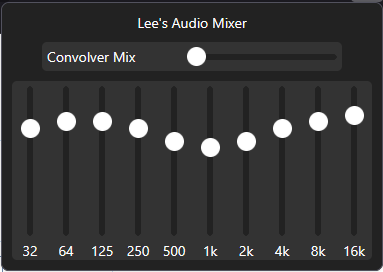

# L33's Audio Equalizer

A browser extension that injects an audio processing script into web pages, providing a customizable equalizer and convolver (reverb) effect for all audio elements. Designed for Firefox and Chrome using Manifest V3.

Available on [Firefox](https://addons.mozilla.org/en-US/firefox/addon/l33s-audio-equalizer/) with OperaGX support coming soon.



## Features
- **9-band Equalizer**: Fine-tune audio frequencies from 32Hz to 8kHz.
- **Reverb Slider**: Simulates a car's interior using a built-in impulse response sample.
- **Stereo Widener**: Puts you in the song.
- **Basic Presets**: Change all of the settings at the same time.

## Installation
1. Clone or download this repository.
2. Build the extension (optional, for TypeScript changes):
   ```
   npm install
   npm run build
   npm run start (Requires Firefox configured with a profile named "Testing" to be setup.)
   ```
3. Load the `src/` directory as an unpacked extension in your browser:
   - **Firefox**: Use [web-ext](https://github.com/mozilla/web-ext) or load as a temporary add-on.
   - **Chrome**: Go to `chrome://extensions`, enable Developer Mode, and load the `src/` folder.
